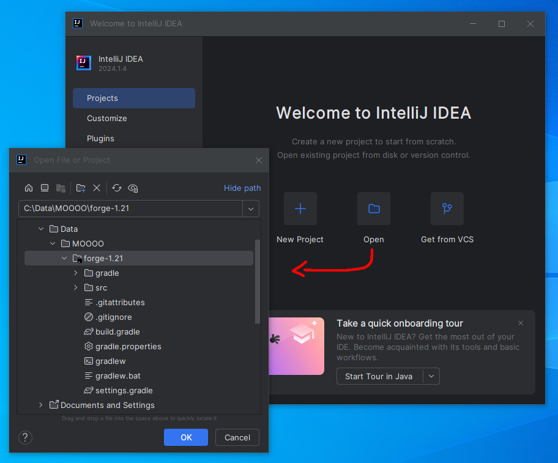
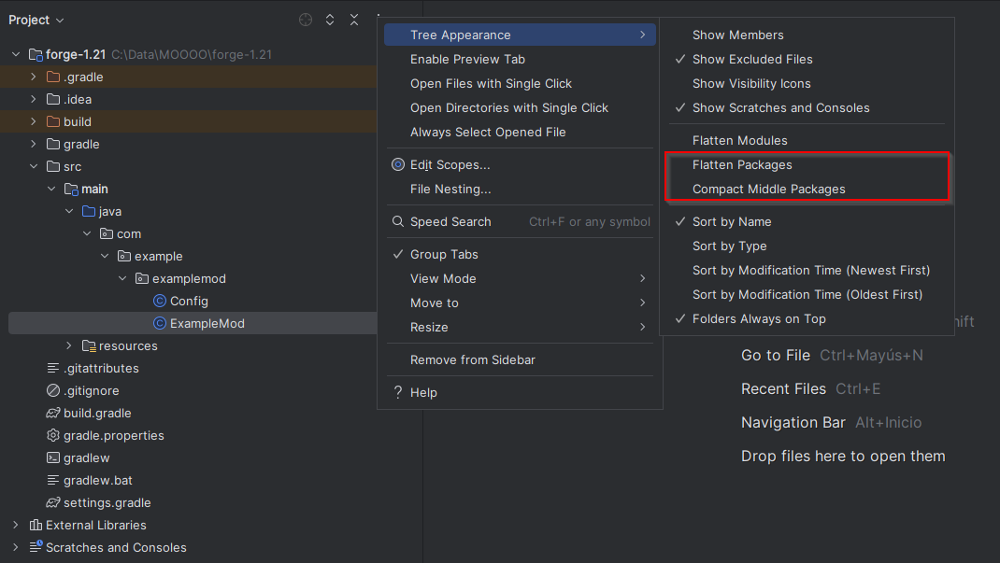

# Modding Minecraft 1.21

## Índice
1. [Instalar JDK](#instalar-jdk)
2. [Instalar IDE](#instalar-ide)
3. [Instalar Forge](#instalar-forge)
4. [Creación mod de prueba](#creación-mod-de-prueba)
5. [Configurar Parchment](#configurar-parchment)
6. [Ejecutar el Cliente](#ejecutar-el-cliente)


### Instalar JDK
Lo primero será descargar un JDK, en nuestro caso Eclipse Temurin. Lo descargamos desde [Adoptium](https://adoptium.net/temurin/releases/?package=jdk&version=22). Seleccionamos el sistema operativo deseado.


Seleccionamos "Establecer la variable JAVA_HOME" y lo instalaremos en la unidad de disco duro local.


### Instalar IDE

Una vez instalado el JDK, necesitaremos un IDE. Nosotros usaremos [Intellij IDEA Community Edition](https://www.jetbrains.com/idea/download/?section=windows).


En la instalación, seleccionamos las siguientes casillas.


### Instalar Forge

Vamos a la página de [FORGE](https://files.minecraftforge.net/net/minecraftforge/forge/index_1.21.html) y descargamos el Mdk de la última versión.


Se nos descargará un zip. Lo descomprimimos en una carpeta y copiamos la ruta.

    C:\Data\MOOOO\forge-1.21

Abrimos nuestro IDE y seleccionamos la carpeta.



En la parte inferior izquierda, veremos un icono de un martillo "Build". Aquí podemos ver que se está descargando todo lo necesario para que el proyecto funcione. Esperamos hasta ver "BUILD SUCCESSFUL", esto puede tardar unos minutos.

Entramos en ``File > Proyect Structure...`` Colocamos el SDK y el nivel de lenguaje en el mismo número.


Ahora entramos en ``File > Settings > Build, Execution, Deployment > Build Tools > Gradle`` y colocamos el Gradle JVM en "Project SDK" o "JAVA_HOME" según deseemos.


### Creación mod de prueba

Esto no es obligatorio pero podemos cambiar la estructura de carpetas. Necesitaremos desmarcar las siguientes opciones.



Entramos en ``ExampleMod.java`` y modificamos el contenido por el fichero ``TMod.java`` que se encuentra en este repositorio. Este archivo continene las clases limpias, modifica el mod_id y cambia la estructura de carpetas.


    Las dependencias se encuentran en ``resources > META-INF > mods.toml``

Es necesario modificar el archivo ``gradle.properties``, lo ajustamos a nuesto ``TMod.java``

````yml
## Mod Properties

# The unique mod identifier for the mod. Must be lowercase in English locale. Must fit the regex [a-z][a-z0-9_]{1,63}
# Must match the String constant located in the main mod class annotated with @Mod.
mod_id=tmod
# The human-readable display name for the mod.
mod_name=TMod
# The license of the mod. Review your options at https://choosealicense.com/. All Rights Reserved is the default.
mod_license=MIT
# The mod version. See https://semver.org/
mod_version=0.1-1.21
# The group ID for the mod. It is only important when publishing as an artifact to a Maven repository.
# This should match the base package used for the mod sources.
# See https://maven.apache.org/guides/mini/guide-naming-conventions.html
mod_group_id=net.placido.tmod
# The authors of the mod. This is a simple text string that is used for display purposes in the mod list.
mod_authors=Placido
# The description of the mod. This is a simple multiline text string that is used for display purposes in the mod list.
mod_description=Example mod for testing.
````

### Configurar Parchment

Ahora cambiamos el ``mapping_channel`` a [Parchment](https://parchmentmc.org/docs/getting-started), para ello necesitamos seguir el Getting Started que nos ofrece la web.

En nuestro caso, en ``settings.gradle`` añadimos lo siguiente:

````java
pluginManagement {
    repositories {
        gradlePluginPortal()
        maven {
            name = 'MinecraftForge'
            url = 'https://maven.minecraftforge.net/'
        }
        maven { url = 'https://maven.parchmentmc.org' } // Añadido
    }
}

plugins {
    id 'org.gradle.toolchains.foojay-resolver-convention' version '0.7.0'
}
````

En ``build.gradle`` añadimos el siguiente id:

````java
plugins {
    id 'eclipse'
    id 'idea'
    id 'maven-publish'
    id 'net.minecraftforge.gradle' version '[6.0.24,6.2)'
    id 'org.parchmentmc.librarian.forgegradle' version '1.+' // Añadido
}
````

Y por último colocamos la version correspondiente en ``gradle.properties``:

````yml
mapping_channel=parchment
# The mapping version to query from the mapping channel.
# This must match the format required by the mapping channel.
mapping_version=2024.06.23-1.21
````

Para guardar los cambios pulsamos en el icono del elefante que se nos muestra arriba a la derecha, pulsamos en "Load Gradle Changes".

Abrimos la terminal y colocamos ``./gradlew genIntellijRuns`` para terminar de descargarlo todo.

### Ejecutar el Cliente

Para poder ejecutar el cliente, necesitamos ir a la parte superior derecha de la pantalla, allí veremos un elefante. Al hacer click sobre él, se abrirá una ventana en la que tendremos que seleccionar ``Task > forgegradle runs > runClient``


