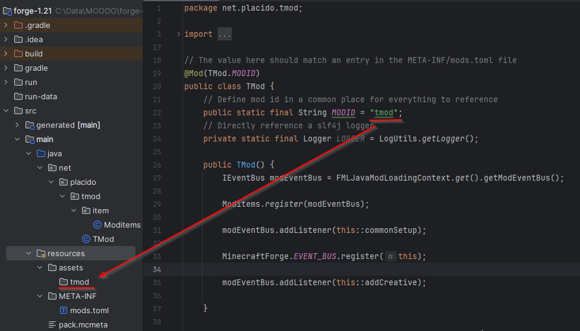
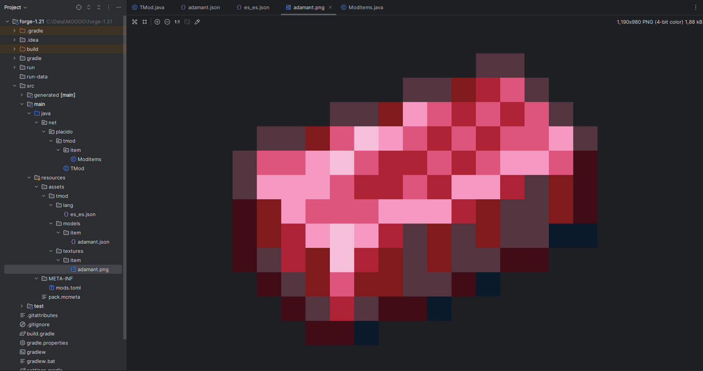
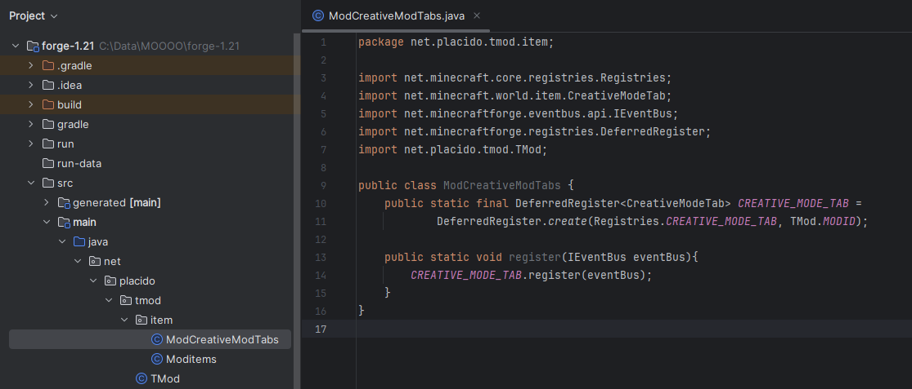

# Items

## Índice
1. [Crear una Nueva Clase](#crear-una-nueva-clase)
2. [Asegurar que los Items se Añadan](#asegurar-que-los-items-se-anadan)
3. [Añadir Item](#anadir-item)
4. [Crear Estructura de Carpetas](#crear-estructura-de-carpetas)
5. [Añadir Nombre al Objeto](#anadir-nombre-al-objeto)
6. [Añadir Textura al Objeto](#anadir-textura-al-objeto)
7. [Crear Nuevo Objeto](#crear-nuevo-objeto)
8. [Crear Tab Personalizado](#crear-tab-personalizado)

## Crear una Nueva Clase
Haz clic derecho sobre la carpeta de tu mod y selecciona `New > Package` para crear la carpeta `item`.


Dentro de esta carpeta, crea una clase de Java y añade el siguiente código:

```java
public class Moditems {
    public static final DeferredRegister<Item> ITEMS =
            DeferredRegister.create(ForgeRegistries.ITEMS, TMod.MODID);
}
```


Probablemente aparecerán varios errores. Si colocas el ratón sobre el error, te dará una posible solución. Haz clic en "More actions..." para realizar las correcciones necesarias.

**DeferredRegister** es básicamente una lista de items que Forge cargará al iniciarse.

## Asegurar que los Items se Añadan
Crea el método `register`, el cual recibe el parámetro `eventBus`:

```java
public class Moditems {
    public static final DeferredRegister<Item> ITEMS =
            DeferredRegister.create(ForgeRegistries.ITEMS, TMod.MODID);

    public static void register(IEventBus eventBus){
        ITEMS.register(eventBus);
    }
}
```

Y en tu `TMod.java`, haz una llamada a este método:

```java
public TMod() {
        IEventBus modEventBus = FMLJavaModLoadingContext.get().getModEventBus();

        Moditems.register(modEventBus); // Añadido

        ...
```

## Añadir Item
Para registrar un nuevo item, añade lo siguiente:

```java
public class Moditems {
    public static final DeferredRegister<Item> ITEMS =
            DeferredRegister.create(ForgeRegistries.ITEMS, TMod.MODID);

    public static final RegistryObject<Item> ADAMANT = ITEMS.register("adamant",
            () -> new Item(new Item.Properties()));

    ...
```

En tu `TMod.java`, añade lo siguiente en el método `addCreative`: 

```java
private void addCreative(BuildCreativeModeTabContentsEvent event) {
        if(event.getTabKey() == CreativeModeTabs.INGREDIENTS) {
            event.accept(Moditems.ADAMANT);
        }
    }
```

Esto hace que cuando se abra el tab en creativo para ver los objetos, se añada el item `ADAMANT` a los ingredientes.

## Crear Estructura de Carpetas
Haz clic derecho sobre la carpeta `resources`, dentro crea un directorio llamado `assets`. En su interior, crea otro con el nombre de tu `MODID`.



Crea la siguiente estructura de carpetas: 

```
└── tmod                    
    ├── lang          
    ├── models    
    │   └── item      
    └── textures  
        └── item      
```

Es muy importante que las carpetas se llamen igual.

## Añadir Nombre al Objeto
En la carpeta `lang` se almacenan los idiomas. En nuestro caso, crea un archivo llamado `es_es.json`. 

[Este repositorio](https://github.com/Blu3Smoke/minecraft-language-files) almacena todos los idiomas.

Aquí coloca el nombre que recibirá el objeto:

```json
{
  "item.tmod.adamant": "Adamant"
}
```

Ten en cuenta que `tmod` es el `MODID` y `adamant` tiene que ser exactamente el nombre que colocaste en la clase `Moditem`.

## Añadir Textura al Objeto
Para crear una textura, añade en la carpeta `items` de `models`, un archivo llamado `adamant.json`. Coloca lo siguiente:

```json
{
  "parent": "item/generated",
  "textures": {
    "layer0": "tmod:item/adamant"
  }
}
```

- **Parent:** Determina cómo se va a mostrar el objeto. Toma la textura 2D y la expande un poco para dar la ilusión de una textura 3D en nuestra mano.
- **Textures:** Definimos `tmod` como el directorio padre, `item` es el directorio que le sigue y `adamant` es un archivo PNG que está buscando en su interior.



Una vez añadida la textura, abre Minecraft como vimos en el apartado de "Primeros Pasos".

Inicia un mundo en creativo, abre el inventario y si navegas al tab de ingredientes verás tu nuevo item.


## Crear Nuevo Objeto
Para crear un nuevo objeto, ve a la clase `Moditems.java` y añade lo siguiente:

```java
    ...
    public static final RegistryObject<Item> RAW_ADAMANT = ITEMS.register("raw_adamant",
            () -> new Item(new Item.Properties()));
    ...
```

En `TMod.java`, añade el objeto en `addCreative`:

```java
    event.accept(Moditems.RAW_ADAMANT);
```

Añade un nombre en tu `es_es.json`:

```json
{
  "item.tmod.adamant": "Adamant",
  "item.tmod.raw_adamant": "Raw Adamant"
}
```

Añade un archivo `raw_adamant.json` en `models > item`:

```json
{
  "parent": "item/generated",
  "textures": {
    "layer0": "tmod:item/raw_adamant"
  }
}
```

Coloca la textura que desees.

## Crear Tab Personalizado
Crea una clase en `tmod > item`, llamada `ModCreativeModTabs.java` con el siguiente contenido:

```java
public class ModCreativeModTabs {
    public static final DeferredRegister<CreativeModeTab> CREATIVE_MODE_TAB =
            DeferredRegister.create(Registries.CREATIVE_MODE_TAB, TMod.MODID);

    public static void register(IEventBus eventBus){
        CREATIVE_MODE_TAB.register(eventBus);
    }
}
```



Ahora, ve a `TMod.java` y haz una llamada al método creado:

```java
public TMod() {
        IEventBus modEventBus = FMLJavaModLoadingContext.get().getModEventBus();

        ModCreativeModTabs.register(modEventBus);

        ...
```

Añade lo siguiente en `ModCreativeTabs.java`:

```java
    ...
    public static final RegistryObject<CreativeModeTab> TUTORIAL_TAB = CREATIVE_MODE_TAB.register("tutorial_tab",
            () -> CreativeModeTab.builder().icon(() -> new ItemStack(Moditems.ADAMANT.get()))
                    .title(Component.translatable("creativetab.tutorial_tab"))
                    .displayItems((pParameters, pOutput) -> {
                        pOutput.accept(Moditems.ADAMANT.get());
                        pOutput.accept(Moditems.RAW_ADAMANT.get());

                        // Añadir items Vanilla
                        pOutput.accept(Items.DIAMOND); // GET es solo para items custom

                    })
                    .build());
    ...
```


Ahora añade la traducción, en el fichero `es_es.json`:

```json
{
  "item.tmod.adamant": "Adamant",
  "item.tmod.raw_adamant": "Raw Adamant",
  "creativetab.tutorial_tab": "Tutorial Tab"
}
```

Si abres Minecraft de nuevo, verás que tienes un nuevo tab y el nuevo item.


